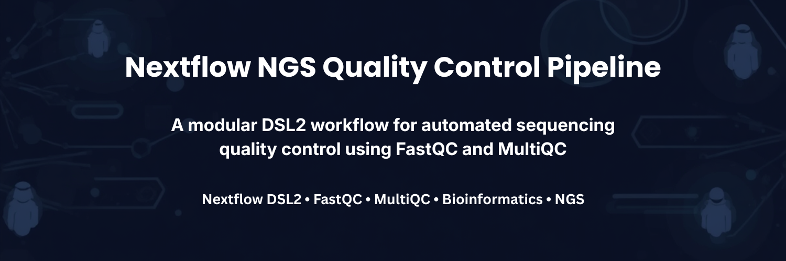
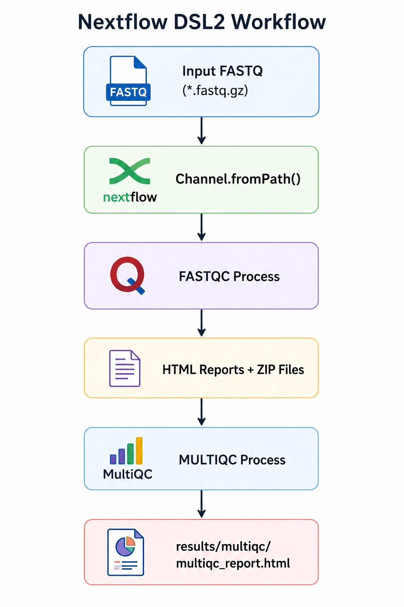
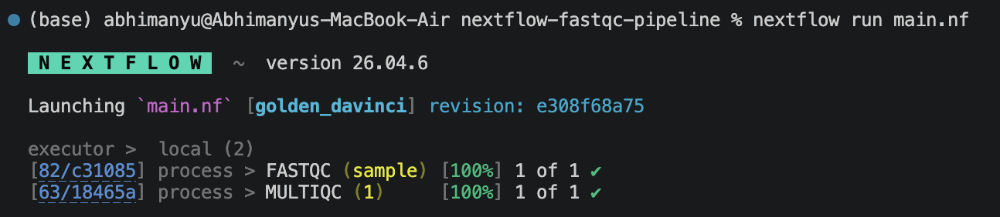
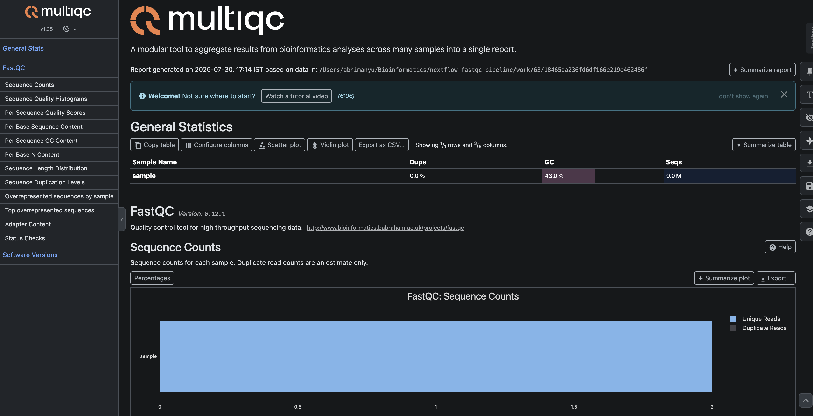
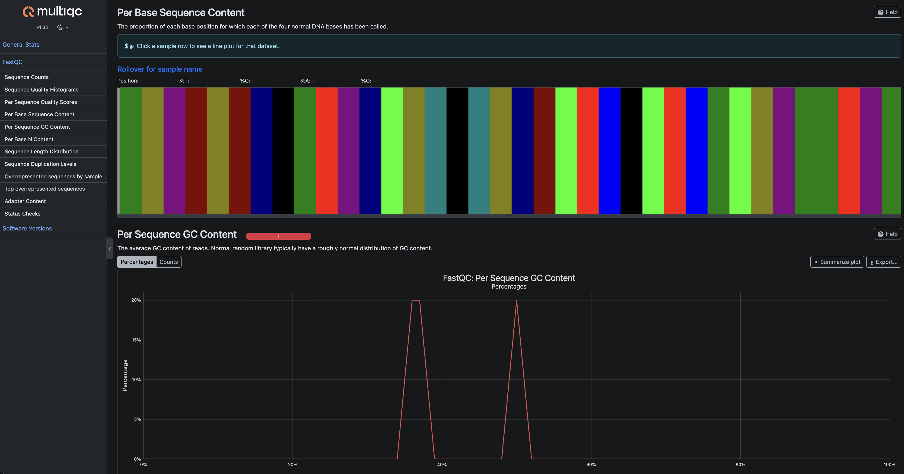

<p align="center">
  
</p>
<h1 align="center">Nextflow NGS Quality Control Pipeline</h1>

<p align="center">
A modular **Nextflow DSL2** pipeline for automated **NGS quality control** using **FastQC** and **MultiQC**.
</p>

<p align="center">
  


</p>

---

## Overview

This project demonstrates how to build a reproducible and modular bioinformatics workflow using **Nextflow DSL2**.

The pipeline performs quality assessment of raw FASTQ sequencing data by:

- Running **FastQC** on input FASTQ files.
- Aggregating quality reports using **MultiQC**.
- Organizing outputs into structured result directories.

This repository serves as a lightweight, extensible template for larger NGS workflows.

---

## Workflow

<p align="center">

</p>

---

## Features

- Modular Nextflow DSL2 architecture
- FastQC quality assessment
- MultiQC report generation
- Organized output directories
- Included test dataset
- Easily extensible for larger NGS pipelines

---

## Project Structure

```text
nextflow-ngs-qc-pipeline/
│
├── main.nf
├── nextflow.config
├── modules/
│   ├── fastqc.nf
│   └── multiqc.nf
├── test_data/
│   └── sample.fastq.gz
├── results/
├── docs/
├── assets/
├── README.md
├── LICENSE
└── .gitignore
```

---

## Requirements

- Nextflow
- Java 21+
- FastQC
- MultiQC

---

## Installation

Clone the repository.

```bash
git clone https://github.com/AbhimanyuMandal/nextflow-ngs-qc-pipeline.git

cd nextflow-ngs-qc-pipeline
```

---

## Usage

Run the pipeline using the included test dataset.

```bash
nextflow run main.nf
```

To use your own FASTQ files:

```bash
nextflow run main.nf --input "data/*.fastq.gz"
```

---

## Output

### Pipeline Execution

<p align="center">

</p>

### MultiQC Summary

<p align="center">

</p>

MultiQC report summarizing sequencing quality metrics generated from FastQC analyses.

### Quality Control Metrics

<p align="center">

</p>

Visualization of sequencing quality metrics, including per-base sequence content and GC content.

---

## Future Improvements

- Docker support
- Conda environment
- nf-core compatible structure
- Automatic adapter trimming
- Support for paired-end sequencing
- GitHub Actions for continuous integration

---

## License

This project is licensed under the MIT License.

---

## Author

**Abhimanyu Mandal**

Computational Biology | Bioinformatics | Genomics | NGS Analysis
